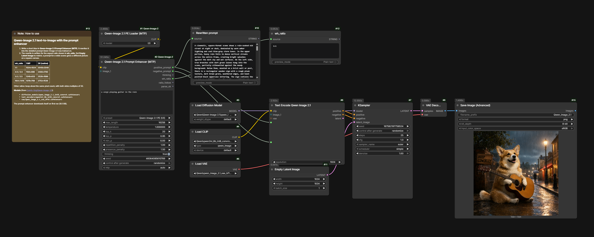
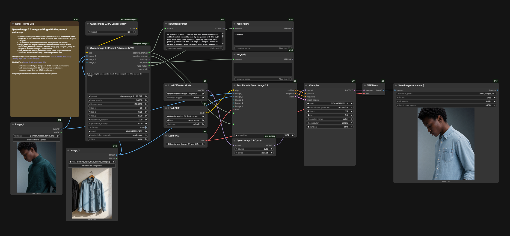

<div align="center">

# ComfyUI-Qwen-Image-2.1-PromptEnhancer-MTP

**ComfyUI nodes for Qwen-Image 2.1's official prompt enhancer, with MTP speculative decoding for faster generation.**

[](https://github.com/Comfy-Org/ComfyUI)
[](#performance)
[](LICENSE)

[Installation](#installation) •
[Quick start](#quick-start) •
[Nodes](#nodes) •
[Performance](#performance) •
[Troubleshooting](#troubleshooting)

</div>

---

## Overview

Qwen-Image 2.1 works best with long, detailed prompts. Its official prompt enhancer (PE) writes them for you: give it a short idea or edit instruction, and it returns a detailed prompt along with the aspect ratio to use.

This extension runs the PE inside ComfyUI with Qwen's own system prompts and settings, and makes it faster with **multi-token prediction (MTP)**: about **1.35×** for text-to-image and **1.65×** for image editing.

- **Automatic setup.** The model downloads and prepares itself on first use.
- **Official settings.** System prompts and sampling values match Qwen's reference code.
- **Ready-to-use outputs.** The rewritten prompt and aspect ratio come out as separate outputs.
- **Multi-image editing.** Up to 10 input images, any size.
- **Heretic versions.** Community abliterated fine-tunes that refuse less, for both t2i and i2i.

## Requirements

- **ComfyUI:** v0.37.0 or newer
- **VRAM:** 16 GB recommended. Smaller GPUs work, but much more slowly.
- **System RAM:** 32 GB recommended
- **Disk space:** about 10 GB per model (t2i for text-to-image, i2i for editing): the 9.5 GB enhancer plus the 0.5 GB MTP head

## Installation

### ComfyUI Manager

> [!NOTE]
> The node is published to the Comfy Registry but is still waiting for review, so it may not show up in the Manager yet. Until then, use the [manual install](#manual).

Open **Manager → Custom Nodes Manager**, search for **Qwen-Image 2.1 Prompt Enhancer (MTP)**, click **Install**, and restart ComfyUI. The Manager installs the requirements too. To update, use **Update** in the same place.

### Manual

Clone the repository into your ComfyUI custom_nodes folder:

```bash
cd ComfyUI/custom_nodes
git clone https://github.com/mozophe/ComfyUI-Qwen-Image-2.1-PromptEnhancer-MTP
```

Everything the node needs already comes with ComfyUI. Optionally, install the requirements (json-repair, which fixes the rare answer that is almost valid JSON). Run the command for your ComfyUI version:

| ComfyUI version | Command |
|---|---|
| Windows portable | From the ComfyUI_windows_portable folder:<br>`python_embeded\python.exe -m pip install -r ComfyUI\custom_nodes\ComfyUI-Qwen-Image-2.1-PromptEnhancer-MTP\requirements.txt` |
| Desktop app | In the app's terminal panel, from the extension's folder:<br>`pip install -r requirements.txt` |
| Manual install | With ComfyUI's virtual environment activated, from the extension's folder:<br>`pip install -r requirements.txt` |

Restart ComfyUI. The first run downloads the model (progress is shown on the node). If the download is interrupted, run the workflow again and it resumes.

To update, run git pull in the extension's folder.

## Quick start

### Sample workflows

The easiest way to start is to drag one of these images into ComfyUI. Each image carries its workflow, so dropping it loads the whole graph. The same workflows are also in the [workflows](workflows) folder as JSON.

**Text-to-image** ([JSON](workflows/qwen_image_2.1_t2i_prompt_enhancer.json))



**Editing with two input images** ([JSON](workflows/qwen_image_2.1_edit_prompt_enhancer.json))



Both are ComfyUI's official Qwen-Image 2.1 templates with the enhancer added in front. They use the int8 models from [Comfy-Org/Qwen-Image-2.1](https://huggingface.co/Comfy-Org/Qwen-Image-2.1).

### Adding it to your own workflow

```
Qwen-Image 2.1 PE Loader (MTP) ──clip──► Qwen-Image 2.1 Prompt Enhancer (MTP) ──positive_prompt──► your text encoder
                           Load Image ──image_1──┘   (editing only)
```

1. Choose the same mode on both nodes: a t2i loader model (t2i or t2i - heretic) with the t2i preset, or an i2i one with the i2i preset.
2. Write a short instruction in prompt:
   - **Text-to-image:** *"a fox reading a book in a snowy forest, watercolor"*
   - **Editing:** *"Put the woman from &lt;image2&gt; into the street in &lt;image1&gt;"*. Images are numbered by the input they are connected to, and can be any size.
3. Use positive_prompt as your prompt.

## Nodes

### Qwen-Image 2.1 PE Loader (MTP)

Loads the prompt enhancer, ready for fast MTP generation.

| Input | Description |
|---|---|
| model | t2i for text-to-image, i2i for editing. The heretic versions are community abliterated fine-tunes that refuse less. |

On first use it downloads the prompt enhancer from [Comfy-Org/Qwen-Image-2.1](https://huggingface.co/Comfy-Org/Qwen-Image-2.1/tree/main/text_encoders) (about 9.5 GB) and the MTP head from [Qwen/Qwen3.5-9B](https://huggingface.co/Qwen/Qwen3.5-9B) (about 0.5 GB), then combines them into a prepared copy in ComfyUI/models/text_encoders/Qwen-Image-2.1-PE/: the int8 convrot enhancer with the MTP head added. If you already have the Comfy-Org PE checkpoint in a text_encoders folder, it is used instead of downloading.

The heretic versions download from [pottokao/Qwen-Image-2.1-PE-T2I-Heretic](https://huggingface.co/pottokao/Qwen-Image-2.1-PE-T2I-Heretic) and [darrellbest/Qwen-Image-2.1-PE-I2I-Heretic](https://huggingface.co/darrellbest/Qwen-Image-2.1-PE-I2I-Heretic) instead. Those are bf16, so the download is about 19 GB, but they are quantized as they stream in to the same int8 convrot format as the Comfy-Org checkpoint. Nothing else is kept on disk, and the prepared copy is the same 10 GB. Use them with the matching t2i or i2i preset.

After setup, the prepared file (the one ending in `.mtp.safetensors`) is an ordinary int8 convrot checkpoint with an MTP head. You can also load it with the stock **Load CLIP** node (type qwen_image), and MTP still works. You only lose the check that the loader and preset modes match.

### Qwen-Image 2.1 Prompt Enhancer (MTP)

ComfyUI's **Generate Text** node with the official PE presets built in.

| Input | Description |
|---|---|
| clip | The enhancer from the loader |
| prompt | Your short instruction |
| image_1 … image_10 | Input images for editing, referred to as &lt;image1&gt;, &lt;image2&gt;… |
| preset | Qwen-Image 2.1 PE (t2i), Qwen-Image 2.1 PE (i2i), or none to use it as a plain Generate Text node |
| seed | Change it for a different result |
| mtp | auto (recommended), off, or a fixed draft depth |

| Output | Description |
|---|---|
| positive_prompt | The detailed prompt, ready for your text encoder |
| negative_prompt | Always empty; the enhancer doesn't write one |
| thinking | The model's reasoning |
| wh_ratio | The chosen aspect ratio, for example 16:9 |
| ratio_follow | Editing only: the image whose shape to keep, for example &lt;image1&gt; |
| parse_ok | false if the answer couldn't be read; positive_prompt then contains the full answer |

The presets use the official values from Qwen's [prompt_rewrite](https://github.com/QwenLM/Qwen-Image-2.1/tree/main/prompt_rewrite) code, and every value can be changed on the node.

> [!IMPORTANT]
> Keep **thinking** on. Both models were trained to reason before answering and give worse prompts without it.

## Performance

Measured on an RTX 4090 Laptop GPU (16 GB), with one input image for editing.

| Mode | max_length | MTP off | MTP on | Speed-up |
|---|---|---|---|---|
| Text-to-image | 16256 (default) | 27 tok/s | 38 tok/s | 1.38× |
| Text-to-image | 8192 | 35 tok/s | 47 tok/s | 1.36× |
| Editing | 24000 (default) | 21 tok/s | 36 tok/s | 1.67× |
| Editing | 8192 | 31 tok/s | 52 tok/s | 1.65× |

> [!TIP]
> Set **max_length** to **8192** for faster results. A typical answer is 2,000–4,000 tokens, so this leaves plenty of room. If an answer is ever cut off, raise it again.

Peak VRAM use was about 14 GB for text-to-image and 16 GB for editing. With MTP on, quality is unchanged, but the same seed gives different text than with MTP off.

## Troubleshooting

<details>
<summary><b>"mtp is on but this Qwen3.5 checkpoint has no MTP head"</b></summary>

The checkpoint has no MTP head. This happens with the original Comfy-Org file, for example. Use **Qwen-Image 2.1 PE Loader (MTP)**, or in **Load CLIP** pick the file whose name ends in `.mtp.safetensors`, which the loader creates on first use.
</details>

<details>
<summary><b>"The PE loader is set to t2i but the preset is … (i2i)"</b></summary>

The loader and the preset are set to different modes. Choose t2i on both for text-to-image, or i2i on both for editing. The heretic models count as their t2i or i2i mode.
</details>

<details>
<summary><b>parse_ok is false</b></summary>

The node couldn't find the rewritten prompt in the answer, so positive_prompt holds the whole answer instead. Check the thinking and positive_prompt outputs to see which case applies:

- **The answer was cut off** (it ends mid-sentence, or positive_prompt is empty): generation reached max_length. Increase it on the node.
- **The JSON is slightly broken**: install the requirements (see [Installation](#installation)) so json-repair can fix it, or run again with a different seed.
- **Thinking is off**: turn it back on; the model follows the answer format less reliably without it.
- **The preset is none**: expected, since that preset doesn't ask for the PE's answer format.
</details>

<details>
<summary><b>The node stopped working after a ComfyUI update</b></summary>

This extension depends on parts of ComfyUI that can change between versions. Please [open an issue](https://github.com/mozophe/ComfyUI-Qwen-Image-2.1-PromptEnhancer-MTP/issues) with the error message and your ComfyUI version.
</details>

## License

The code in this repository is released under the [MIT License](LICENSE).

The prompt enhancer weights and system prompts are released under the non-commercial [Qwen Research License](https://huggingface.co/Qwen/Qwen-Image-2.1-PE-I2I/blob/main/LICENSE). They are not included in this repository; they are downloaded on first use.

## Acknowledgements

- [Qwen team](https://github.com/QwenLM/Qwen-Image-2.1) for Qwen-Image 2.1, the prompt enhancers and the reference implementation
- [Comfy-Org](https://github.com/Comfy-Org/ComfyUI) for ComfyUI, its Qwen3.5 text encoder and MTP decoding, and the [int8 checkpoints](https://huggingface.co/Comfy-Org/Qwen-Image-2.1)
