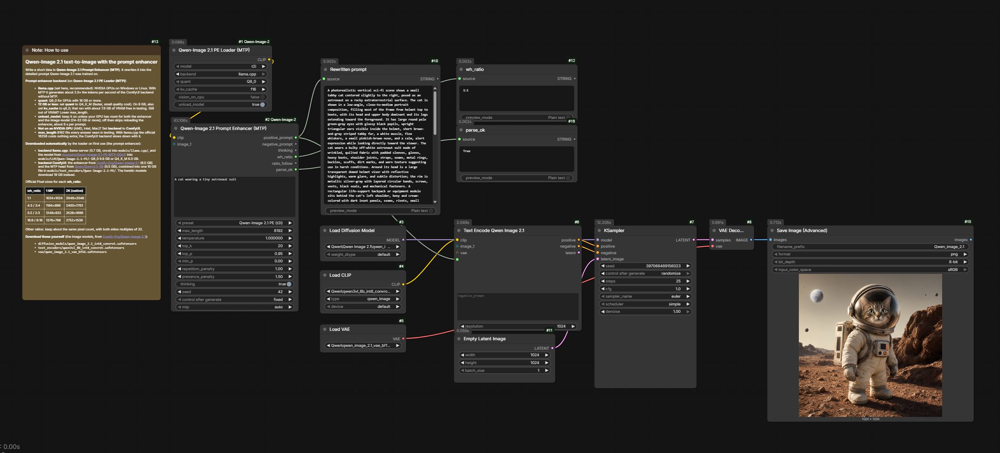
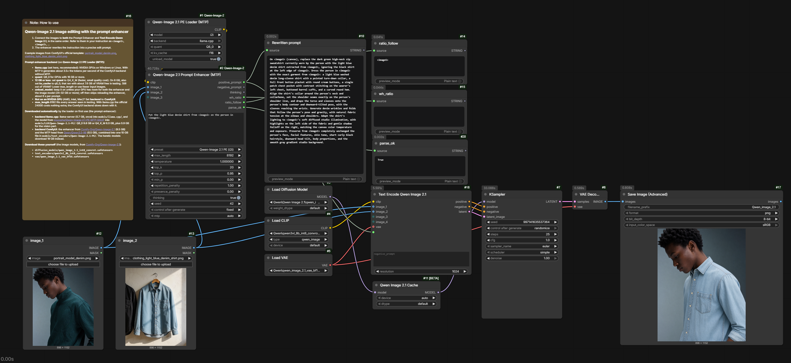

<div align="center">

# ComfyUI Qwen-Image 2.1 Prompt Enhancer (MTP)

**ComfyUI nodes for Qwen-Image 2.1's official prompt enhancer, run with llama.cpp or natively in ComfyUI, with MTP speculative decoding for faster generation.**

[](https://github.com/Comfy-Org/ComfyUI)
[](#performance)
[](LICENSE)

[Installation](#installation) •
[Quick start](#quick-start) •
[Backends](#backends) •
[Nodes](#nodes) •
[Performance](#performance) •
[Troubleshooting](#troubleshooting) •
[Changelog](#changelog)

</div>

---

## Overview

Qwen-Image 2.1 works best with long, detailed prompts. Its official prompt enhancer (PE) writes them for you: give it a short idea or edit instruction, and it returns a detailed prompt.

This extension runs the PE with Qwen's own system prompts and settings, on one of two backends chosen on the loader:

- **llama.cpp**: for NVIDIA GPUs. It runs the PE in a separate llama-server process with MTP, at about **2×** (text-to-image) to **3.5×** (editing) the speed of ComfyUI's own text generation, at the same quality.
- **ComfyUI**: for any other GPU. It runs the PE inside ComfyUI with MTP, as versions before 1.2.0 did, at about **1.4×** (text-to-image) to **1.7×** (editing) the speed of ComfyUI's own text generation. It is the loader's default so older workflows keep working unchanged; on an NVIDIA GPU, switch to llama.cpp.

Speeds are tokens per second at the official settings; see [Performance](#performance).

**Features**

- **Automatic setup.** The model, and llama-server for the llama.cpp backend, download on first use.
- **Official settings.** System prompts and sampling values match Qwen's reference code.
- **Multi-token prediction (MTP)** on both backends, for faster generation at the same quality.
- **Ready-to-use output.** The rewritten prompt comes out on its own, separate from the model's reasoning.
- **Multi-image editing.** Up to 10 input images, any size.
- **Heretic versions.** Community abliterated fine-tunes that refuse less, for both t2i and i2i.
- **Runs on NVIDIA GPUs with 8 GB or more.** With llama.cpp and quant Q4_K_M, the enhancer ran at full speed in about 7.6 GB of VRAM at the official max_length, for text-to-image and for editing with two images. More images need more VRAM; kv_cache q8_0 helps (see [Performance](#performance)).

## Requirements

- **ComfyUI:** v0.37.0 or newer
- **System RAM:** 32 GB recommended

| | llama.cpp (recommended) | ComfyUI (default, for backward compatibility) |
|---|---|---|
| GPU | NVIDIA, on Windows or Linux | Any GPU ComfyUI supports |
| VRAM | 8 GB or more | 16 GB recommended |
| Disk per model | 6–10 GB, plus 0.7 GB once | About 10 GB |

- **NVIDIA driver** for llama.cpp: 528.33 or newer on Windows, 525.60.13 or newer on Linux (x64).
- **VRAM** with llama.cpp: quant Q8_0 on 16 GB or more; Q4_K_M runs on 8 GB or more. With the ComfyUI backend, smaller GPUs work, but much more slowly.
- **Disk** with llama.cpp: the model is 9.8 GB (Q8_0) or 6.0 GB (Q4_K_M), and editing adds 0.9 GB for the vision part; llama-server is 0.7 GB, downloaded once.

## Installation

### ComfyUI Manager

Open **Manager → Custom Nodes Manager**, search for **Qwen-Image 2.1 Prompt Enhancer (MTP)**, click **Install**, and restart ComfyUI. The Manager installs the requirements too. To update, use **Update** in the same place.

### Manual

Clone the repository into your ComfyUI custom_nodes folder:

```bash
cd ComfyUI/custom_nodes
git clone https://github.com/mozophe/ComfyUI-Qwen-Image-2.1-PromptEnhancer-MTP
```

Everything the node needs already comes with ComfyUI. Optionally, install the requirements (json-repair, which fixes the rare answer that is almost valid JSON). Run the command for your ComfyUI version:

| ComfyUI version | Command |
|---|---|
| Windows portable | From the ComfyUI_windows_portable folder:<br>`python_embeded\python.exe -m pip install -r ComfyUI\custom_nodes\ComfyUI-Qwen-Image-2.1-PromptEnhancer-MTP\requirements.txt` |
| Desktop app | In the app's terminal panel, from the extension's folder:<br>`pip install -r requirements.txt` |
| Manual install | With ComfyUI's virtual environment activated, from the extension's folder:<br>`pip install -r requirements.txt` |

Restart ComfyUI. Nothing else needs installing for either backend. The first run downloads the model, and llama-server for the llama.cpp backend (progress is shown on the node). If the download is interrupted, run the workflow again and it resumes.

To update, run git pull in the extension's folder.

## Quick start

### Sample workflows

The easiest way to start is to drag one of these images into ComfyUI. Each image carries its workflow, so dropping it loads the whole graph. The same workflows are also in the [workflows](workflows) folder as JSON.

**Text-to-image** ([JSON](workflows/qwen_image_2.1_t2i_prompt_enhancer.json))



**Editing with two input images** ([JSON](workflows/qwen_image_2.1_edit_prompt_enhancer.json))



Both are ComfyUI's official Qwen-Image 2.1 templates with the enhancer added in front. They use the int8 models from [Comfy-Org/Qwen-Image-2.1](https://huggingface.co/Comfy-Org/Qwen-Image-2.1).

> [!TIP]
> The sample workflows use the recommended llama.cpp backend with quant Q8_0. **Not on an NVIDIA GPU?** Set the loader's **backend** to `ComfyUI`. Below 16 GB, set **quant** to Q4_K_M. Each workflow's note lists what the loader downloads for each backend, and which image models to download yourself. If your image models are in subfolders, re-select them in Load Diffusion Model, Load CLIP and Load VAE.

### Adding it to your own workflow

```
Qwen-Image 2.1 PE Loader (MTP) ──clip──► Qwen-Image 2.1 Prompt Enhancer (MTP) ──positive_prompt──► your text encoder
                           Load Image ──image_1──┘   (editing only)
```

1. On the loader, set **backend** to `llama.cpp` if you have an NVIDIA GPU (quant Q8_0 on 16 GB or more, Q4_K_M below 16 GB); otherwise keep ComfyUI.
2. Choose the same mode on both nodes: a t2i loader model (t2i or t2i - heretic) with the t2i preset, or an i2i one with the i2i preset.
3. Write a short instruction in prompt:
   - **Text-to-image:** *"a fox reading a book in a snowy forest, watercolor"*
   - **Editing:** *"Put the woman from &lt;image2&gt; into the street in &lt;image1&gt;"*. Images are numbered by the input they are connected to, and can be any size.
4. Use positive_prompt as your prompt.

## Backends

### llama.cpp (recommended on NVIDIA)

Set the loader's **backend** to `llama.cpp`. The loader then runs the prompt enhancer with [llama.cpp](https://github.com/ggml-org/llama.cpp) in a separate llama-server process. The generator node, its presets and its outputs stay the same.

**Why use it:** it generates the enhanced prompt much faster than the ComfyUI backend: with MTP on both, 47 vs 34 tok/s for text-to-image (1.4×) and 68 vs 33 tok/s for editing with two images (2.1×). Its speed doesn't drop with a higher max_length, so the official lengths cost nothing extra. Its Q8_0 model matches the quality of the int8 model the ComfyUI backend uses. See [Performance](#performance).

**Why llama-server and not llama-cpp-python?** The node runs llama.cpp's own prebuilt `llama-server` as a separate process instead of installing the `llama-cpp-python` package into ComfyUI:

- **Nothing is installed into ComfyUI's Python.** llama-cpp-python can change numpy and other packages that ComfyUI and other custom nodes depend on. Its CUDA builds also exist only for some Python, CUDA and OS combinations, and otherwise need a C++ compiler.
- **One pinned, verified build.** The node downloads a specific llama.cpp release (b11160), chosen for your NVIDIA driver and checked against its SHA-256, so everyone runs the same tested version.

**Downloads (first use):**

- llama-server, a pinned prebuilt llama.cpp release (about 0.7 GB, once), into `ComfyUI/models/llama.cpp/`. The node picks the CUDA 13 or CUDA 12 build that matches your driver.
- The model from [mozophe/Qwen-Image-2.1-PE-MTP-GGUF](https://huggingface.co/mozophe/Qwen-Image-2.1-PE-MTP-GGUF): Q8_0 9.8 GB or Q4_K_M 6.0 GB, plus 0.9 GB for the i2i vision part, into `ComfyUI/models/LLM/Qwen-Image-2.1-PE/`. If you already have the file anywhere under `models/LLM`, it is used where it is.

The GGUFs include the MTP head, so MTP works here too. The model card lists how they were built and their quality measurements.

**Choosing settings:**

- **quant:** Q8_0 on 16 GB GPUs and up. Q4_K_M below 16 GB, down to 8 GB; it is also faster, with a small quality cost, so it is worth trying on bigger GPUs too.
- **kv_cache:** f16 by default. q8_0 saves about 0.3–0.6 GB (more with longer prompts, such as several input images) at almost no quality cost. Use it when the PE runs short of VRAM, on any GPU and quant, such as when editing with several images.
- **vision_on_cpu:** off by default. On, editing keeps the vision part in system RAM, saving about 1.2 GB of VRAM, but reading the images takes much longer: about 13 s per image on an RTX 4090 Laptop's CPU. Use it when editing runs out of VRAM, on any GPU and quant, after the other steps in [Troubleshooting](#troubleshooting).
- **unload_model:** on by default: the PE's VRAM is freed after each prompt so the rest of the workflow gets the GPU. Turn it off only if your GPU has room for both the PE (about 10 GB for Q8_0, 6 GB for Q4_K_M) and your other models, typically 24–32 GB or more. Each prompt then skips reloading the PE, about 6 s faster for text-to-image on an RTX 4090 Laptop. On a GPU that's too small the rest of the workflow slows down instead, since ComfyUI can't free llama-server's memory.
- **max_length:** you can raise it to the official values (16256 for text-to-image, 24000 for editing) without slowing down; it only reserves a little more memory.

llama-server runs as a separate process. With unload_model on, the node unloads ComfyUI's models before each prompt, and llama-server frees its VRAM about a second after answering, so the rest of the workflow gets the GPU back. With it off, both stay loaded, and ComfyUI's models are unloaded only when llama-server has to start. It stops when ComfyUI exits. After ComfyUI starts, or when you change the model, quant, kv_cache, vision_on_cpu, unload_model or mtp setting, the first prompt takes a few seconds longer while llama-server starts.

The `none` preset isn't supported with the llama.cpp backend.

### ComfyUI (default, for backward compatibility)

Runs the prompt enhancer inside ComfyUI with its own Qwen3.5 text encoder and MTP decoding, on any GPU ComfyUI supports. It is the default for backward compatibility: this is how versions before 1.2.0 ran the PE, so their workflows keep working unchanged, and it runs on GPUs llama.cpp doesn't support here.

On first use it downloads the prompt enhancer from [Comfy-Org/Qwen-Image-2.1](https://huggingface.co/Comfy-Org/Qwen-Image-2.1/tree/main/text_encoders) (about 9.5 GB) and the MTP head from [Qwen/Qwen3.5-9B](https://huggingface.co/Qwen/Qwen3.5-9B) (about 0.5 GB), then combines them into a prepared copy in ComfyUI/models/text_encoders/Qwen-Image-2.1-PE/: the int8 convrot enhancer with the MTP head added. If you already have the Comfy-Org PE checkpoint in a text_encoders folder, it is used instead of downloading.

The heretic versions download from [pottokao/Qwen-Image-2.1-PE-T2I-Heretic](https://huggingface.co/pottokao/Qwen-Image-2.1-PE-T2I-Heretic) and [darrellbest/Qwen-Image-2.1-PE-I2I-Heretic](https://huggingface.co/darrellbest/Qwen-Image-2.1-PE-I2I-Heretic) instead. Those are bf16, so the download is about 19 GB, but they are quantized as they stream in to the same int8 convrot format as the Comfy-Org checkpoint. Nothing else is kept on disk, and the prepared copy is the same 10 GB.

After setup, the prepared file (the one ending in `.mtp.safetensors`) is an ordinary int8 convrot checkpoint with an MTP head. You can also load it with the stock **Load CLIP** node (type qwen_image), and MTP still works. You only lose the check that the loader and preset modes match.

This backend gets slower as max_length grows, so the presets default to 8192.

It has no unload_model option because it doesn't need one: ComfyUI's dynamic VRAM moves its own models between RAM and VRAM as they're needed, and in testing, keeping them loaded made no difference to its speed.

## Nodes

### Qwen-Image 2.1 PE Loader (MTP)

Loads the prompt enhancer, ready for fast MTP generation.

| Input | Description |
|---|---|
| model | t2i for text-to-image, i2i for editing. The heretic versions are community abliterated fine-tunes that refuse less. |
| backend | llama.cpp (recommended on NVIDIA) runs the PE in a separate llama-server process, much faster. ComfyUI (default, for backward compatibility with versions before 1.2.0) runs it inside ComfyUI on any GPU. See [Backends](#backends). |
| quant | llama.cpp only: Q8_0 (9.8 GB, for 16 GB GPUs and up) or Q4_K_M (6.0 GB, for 8 GB GPUs and up) |
| kv_cache | llama.cpp only: f16 (default) or q8_0, which stores the KV cache at 8 bits to save memory |
| vision_on_cpu | llama.cpp only, editing: off (default) keeps the vision part on the GPU; on keeps it in system RAM, about 1.2 GB less VRAM but much slower image reading |
| unload_model | llama.cpp only: on (default) frees the PE's VRAM after each prompt; off keeps it and ComfyUI's models loaded, for GPUs with room for both |

Where each backend gets its model is described under [Backends](#backends).

### Qwen-Image 2.1 Prompt Enhancer (MTP)

ComfyUI's **Generate Text** node with the official PE presets built in.

| Input | Description |
|---|---|
| clip | The enhancer from the loader |
| prompt | Your short instruction |
| image_1 … image_10 | Input images for editing, referred to as &lt;image1&gt;, &lt;image2&gt;… |
| preset | Qwen-Image 2.1 PE (t2i), Qwen-Image 2.1 PE (i2i), or none to use it as a plain Generate Text node |
| seed | Change it for a different result |
| mtp | auto (recommended), off, or a fixed draft depth |

| Output | Description |
|---|---|
| positive_prompt | The detailed prompt, ready for your text encoder |
| negative_prompt | Always empty; the enhancer doesn't write one |
| thinking | The model's reasoning |
| wh_ratio | The chosen aspect ratio, for example 16:9 |
| ratio_follow | Editing only: the image whose shape to keep, for example &lt;image1&gt; |
| parse_ok | false if the answer couldn't be read; positive_prompt then contains the full answer |

The presets use the official values from Qwen's [prompt_rewrite](https://github.com/QwenLM/Qwen-Image-2.1/tree/main/prompt_rewrite) code, except max_length: it defaults to 8192 instead of 16256 (t2i) and 24000 (i2i), because a higher max_length slows the ComfyUI backend. In testing, answers were 800–5,400 tokens, so 8192 leaves room; if an answer is ever cut off, raise it. With llama.cpp the official values cost nothing extra. Every value can be changed on the node.

> [!IMPORTANT]
> Keep **thinking** on. Both models were trained to reason before answering and give worse prompts without it.

## Performance

Measured on 2026-09-30 on an RTX 4090 Laptop GPU (16 GB), through the nodes in ComfyUI, 6 prompts per configuration. Editing used two input images. All runs used the **official Qwen-Image 2.1 Prompt Enhancer settings**: the t2i or i2i preset (Qwen's system prompts and sampling values, thinking on) with the official max_length, 16256 for text-to-image and 24000 for editing.

Speed is compared in tokens generated per second (tok/s), not total time: the PE writes answers of different lengths from run to run, so time alone would mix length with speed. Tok/s is the answer's tokens divided by the time the PE took, including everything the backend does, such as llama.cpp waking up and freeing VRAM. Each step adds one change to the one before, starting from the ComfyUI backend without MTP.

**Text-to-image**

| Step | Tok/s | Step gain | Total vs baseline |
|---|---|---|---|
| ComfyUI, MTP off (baseline) | 23.5 | – | 1.00× |
| + MTP | 33.9 | 1.44× | 1.44× |
| + llama.cpp (Q8_0) | **46.8** | 1.38× | **1.99×** |
| + Q4_K_M (small quality cost) | 63.2 | 1.35× | 2.69× |

**Editing (two input images)**

| Step | Tok/s | Step gain | Total vs baseline |
|---|---|---|---|
| ComfyUI, MTP off (baseline) | 19.4 | – | 1.00× |
| + MTP | 32.6 | 1.68× | 1.68× |
| + llama.cpp (Q8_0) | **67.8** | 2.08× | **3.49×** |
| + Q4_K_M (small quality cost) | 85.2 | 1.26× | 4.39× |

- llama.cpp without MTP ran at 42.3 tok/s for text-to-image (1.80× the baseline) and 46.6 tok/s for editing (2.40×).
- With llama.cpp, max_length 8192, 16256 and 24000 gave the same speed.
- With MTP on, quality is unchanged, but the same seed gives different text than with MTP off.
- Q8_0 (llama.cpp) and int8 convrot (ComfyUI) drift about equally little from the bf16 model; the [model card](https://huggingface.co/mozophe/Qwen-Image-2.1-PE-MTP-GGUF) has the measurements.
- With Q4_K_M, llama.cpp ran at full speed when limited to about 7.6 GB of VRAM (a 16 GB GPU with the rest filled), for text-to-image and editing with two images at the official max_length, with kv_cache f16 or q8_0.
- Editing with five images (about 1 MP each) at the official max_length peaked at about 8.3 GB of VRAM with Q4_K_M and kv_cache f16: the longer prompt needs a larger KV cache. kv_cache q8_0 or max_length 8192 each save about 0.6 GB there. With vision_on_cpu, the same run peaked at about 7.2 GB, but reading the five images took about 67 s instead of 4 s.

### At the node's default max_length (8192)

The same runs at max_length 8192. The ComfyUI backend is faster here than at the official lengths, which narrows llama.cpp's lead. Totals are relative to ComfyUI without MTP at 8192.

**Text-to-image**

| Step | Tok/s | Step gain | Total vs baseline |
|---|---|---|---|
| ComfyUI, MTP off (baseline) | 30.8 | – | 1.00× |
| + MTP | 41.1 | 1.33× | 1.33× |
| + llama.cpp (Q8_0) | **47.0** | 1.14× | **1.53×** |
| + Q4_K_M (small quality cost) | 62.6 | 1.33× | 2.03× |

**Editing (two input images)**

| Step | Tok/s | Step gain | Total vs baseline |
|---|---|---|---|
| ComfyUI, MTP off (baseline) | 27.9 | – | 1.00× |
| + MTP | 45.8 | 1.64× | 1.64× |
| + llama.cpp (Q8_0) | **67.7** | 1.48× | **2.43×** |
| + Q4_K_M (small quality cost) | 85.4 | 1.26× | 3.06× |

All 60 answers at 8192 parsed, and none reached the limit. The longest was 5,437 tokens (editing), so 8192 fit every answer, though editing answers can come within a few thousand tokens of it.

## Troubleshooting

<details>
<summary><b>"mtp is on but this Qwen3.5 checkpoint has no MTP head"</b></summary>

The checkpoint has no MTP head. This happens with the original Comfy-Org file, for example. Use **Qwen-Image 2.1 PE Loader (MTP)**, or in **Load CLIP** pick the file whose name ends in `.mtp.safetensors`, which the loader creates on first use.
</details>

<details>
<summary><b>"The PE loader is set to t2i but the preset is … (i2i)"</b></summary>

The loader and the preset are set to different modes. Choose t2i on both for text-to-image, or i2i on both for editing. The heretic models count as their t2i or i2i mode.
</details>

<details>
<summary><b>parse_ok is false</b></summary>

The node couldn't find the rewritten prompt in the answer, so positive_prompt holds the whole answer instead. Check the thinking and positive_prompt outputs to see which case applies:

- **The answer was cut off** (it ends mid-sentence, or positive_prompt is empty): generation reached max_length. Increase it on the node.
- **The JSON is slightly broken**: install the requirements (see [Installation](#installation)) so json-repair can fix it, or run again with a different seed.
- **Thinking is off**: turn it back on; the model follows the answer format less reliably without it.
- **The preset is none**: expected, since that preset doesn't ask for the PE's answer format.
</details>

<details>
<summary><b>llama.cpp backend: "needs an NVIDIA GPU" or "nvidia-smi could not read the NVIDIA driver version"</b></summary>

The llama.cpp backend only runs on NVIDIA GPUs under Windows or Linux (x64), and uses `nvidia-smi` to pick its build. Update the NVIDIA driver, or set the loader's backend to ComfyUI.
</details>

<details>
<summary><b>llama.cpp backend: out of VRAM</b></summary>

Try these in order, cheapest first:

1. Set **quant** to Q4_K_M.
2. Set **kv_cache** to q8_0.
3. Lower **max_length** back to 8192 if you raised it (8192 fit every answer in the [Performance](#performance) tests).
4. Set **mtp** to off on the Prompt Enhancer node. It's slower, but llama.cpp then skips loading the MTP head.
5. When editing, turn on **vision_on_cpu** on the loader. It saves about 1.2 GB, but reading the images takes much longer.
6. Use fewer input images.

The error shows the last lines of llama-server's log, which is saved as `llama-server.log` in ComfyUI's temp folder.
</details>

<details>
<summary><b>llama.cpp backend: a download failed</b></summary>

Run the workflow again; downloads resume. The error names the file and URL.
</details>

<details>
<summary><b>The node stopped working after a ComfyUI update</b></summary>

This extension depends on parts of ComfyUI that can change between versions. Please [open an issue](https://github.com/mozophe/ComfyUI-Qwen-Image-2.1-PromptEnhancer-MTP/issues) with the error message and your ComfyUI version.
</details>

## Changelog

- **1.2.1** (2026-10-01): updated README and registry description. No code changes.
- **1.2.0** (2026-09-30): llama.cpp backend, recommended on NVIDIA GPUs.
  - New **backend** option on the loader: `llama.cpp` runs the PE in a separate llama-server process on NVIDIA GPUs (Windows/Linux x64). ComfyUI stays the default for backward compatibility, so workflows from earlier versions run unchanged.
  - Speed, in tok/s against the ComfyUI backend without MTP: with MTP and Q8_0, about 2.0× (text-to-image) to 3.5× (editing) at the official max_length, and 1.5× to 2.4× at the node's 8192 default; Q4_K_M reaches 2.7× to 4.4× at the official max_length. Its speed doesn't depend on max_length. See [Performance](#performance).
  - GGUFs with the MTP head for all four models (t2i, i2i and both heretic versions) at [mozophe/Qwen-Image-2.1-PE-MTP-GGUF](https://huggingface.co/mozophe/Qwen-Image-2.1-PE-MTP-GGUF): Q8_0 for 16 GB GPUs, Q4_K_M for 8 GB and up, and one shared vision file for editing. GGUFs already under models/LLM are used where they are.
  - Smaller GPUs: with Q4_K_M, the enhancer runs on NVIDIA GPUs with 8 GB or more without slowing down.
  - llama-server downloads on first use: a pinned llama.cpp release, CUDA 12 or 13 build chosen from the driver, checked against its SHA-256.
  - **vision_on_cpu** on the loader keeps the vision part in system RAM when editing, saving about 1.2 GB of VRAM at the cost of much slower image reading, for editing that runs out of VRAM on any GPU.
  - llama-server frees its VRAM after each prompt and stops with ComfyUI. On GPUs with room for both, turn off **unload_model** to keep it and ComfyUI's models loaded between prompts.
  - The console shows the same "Generating tokens" progress bar with the live speed (tokens per second) as the ComfyUI backend.
  - The sample workflows use the llama.cpp backend, and their notes list what each backend downloads and the settings for smaller GPUs.
- **1.1.2** (2026-09-24): max_length defaults to 8192 instead of 16256/24000, which is faster, and answers fit well within it.
- **1.1.1** (2026-09-24): the PE seed defaults to a fixed 42; refreshed sample workflows.
- **1.1.0** (2026-09-24): heretic t2i and i2i models.
- **1.0.0** (2026-09-23): first release on the Comfy Registry.

## License

The code in this repository is released under the [MIT License](LICENSE).

The prompt enhancer weights and system prompts are released under the non-commercial [Qwen Research License](https://huggingface.co/Qwen/Qwen-Image-2.1-PE-I2I/blob/main/LICENSE). They are not included in this repository; they are downloaded on first use. The GGUFs for the llama.cpp backend are derived from them and use the same license.

## Acknowledgements

- [Qwen team](https://github.com/QwenLM/Qwen-Image-2.1) for Qwen-Image 2.1, the prompt enhancers and the reference implementation
- [Comfy-Org](https://github.com/Comfy-Org/ComfyUI) for ComfyUI, its Qwen3.5 text encoder and MTP decoding, and the [int8 checkpoints](https://huggingface.co/Comfy-Org/Qwen-Image-2.1)
- [ggml-org](https://github.com/ggml-org/llama.cpp) for llama.cpp, its Qwen3.5 support and MTP speculative decoding
